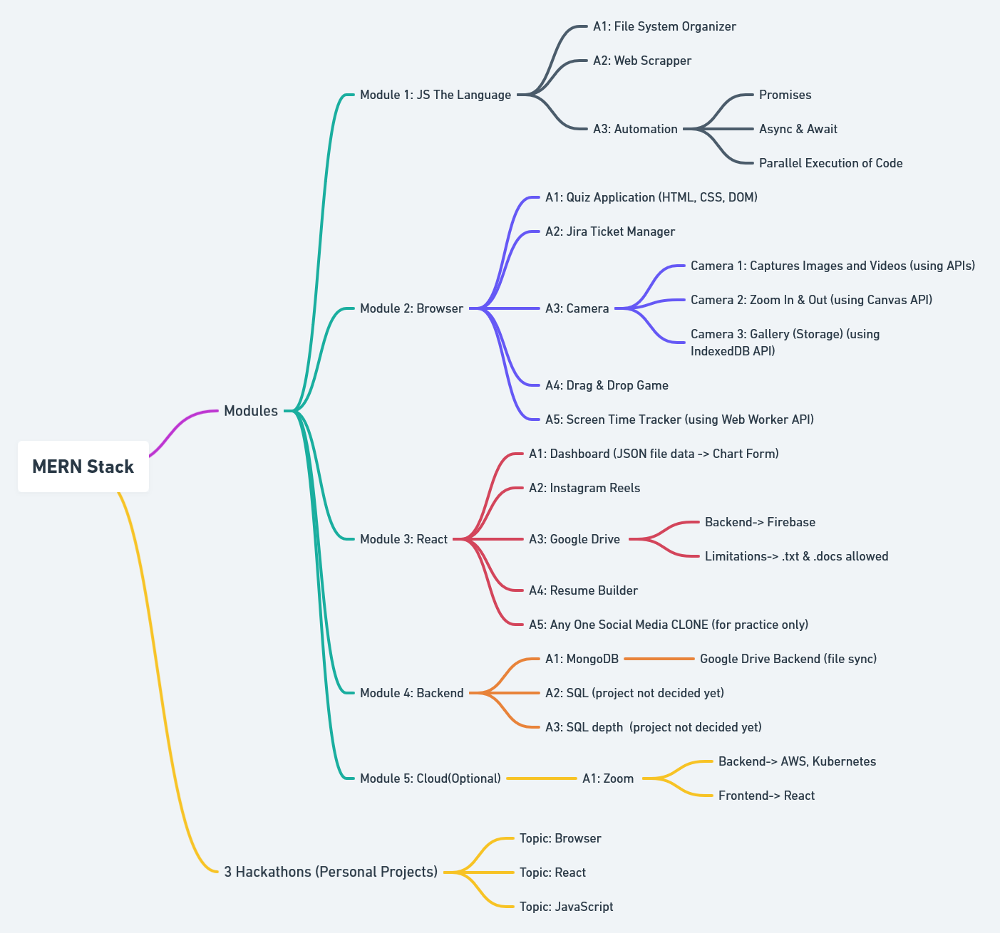

# Web Development ( MERN Stack )

 INSTRUCTORS
#### Instructors: Jasbir Singh

## Course Description

We'll learn Web Development via different Modules(eg. JS, Browser, React etc) and each Module will consist of different Activities(ie projects).

All the study material and the assignments which I made/ got and did respectively for Web Development will be uploaded here.

*This course is part of the "Pepcoding Placement Program".

## Web Development Curriculum:

## How to efficiently use the Resources:

 Modules will contain 2 type of Folders, one for Test and it's Theory, and the other for Activites and Assignments. 

 (All Test Theory Lectures discussed in class will be inside "Lecture 00" along with test references, question and solution. And these Lectures will also be available outside of "Lecture 00" for continuity.) 

