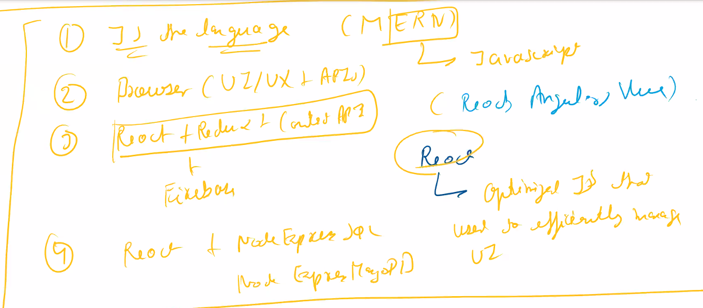

# Web Development ( MERN Stack )

 INSTRUCTORS
#### Instructors: Jasbir Singh

## Course Description

We'll learn Web Development via different Modules(eg. JS, Browser, React etc) and each Module will consist of different Activities(ie projects).
(This is considered to be a more better approach for learning dev)
All the study material and the assignments which I made/ got and did respectively for Web Development will be uploaded here.

*This course is part of the "Pepcoding Placement Program".

## Web Development Curriculum:

